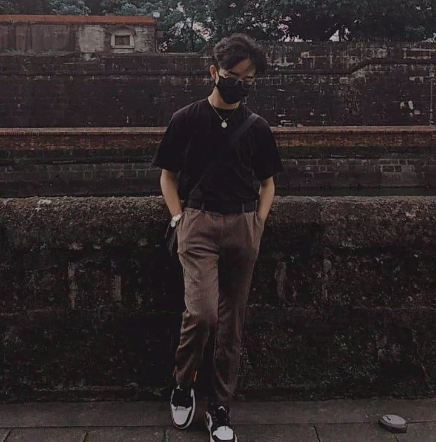

# Software-Design-Prefinal-Exam
<html>

    <head>

        <title>Softare Design Pre-final Exam</title>

        

        <link rel="stylesheet" href="style.css"/>

    </head>

    <body>

        

            <h1 id="h1">Hi! Welcome to your pre-final examination</h1>

            <noscript>
Please enable javascript on your web browser for you to take this exam
</noscript>

            
You are seeing this page because you <em>forked</em> this repository on GitHub.

            
The objective of this exam is for you to learn the approach to modern code review techniques like <strong>pull-based development</strong>.

            
Your task is to append your name, a short description, and your favorite photo of yourself to this HTML page, using your <em>forked</em> version of this project.

            
You are only allowed to edit the HTML code and the images folder. Do not edit the CSS and JS code.

            
You are allowed to view and use the defined CSS classes, and you are allowed to add inline CSS.

            
Once you're done, create a <em>pull request</em> in the GitHub repository. This will allow me to review your edits before pushing it to the main repository.

            
You can reference my entry below:

        

        

            

            <h2>Jeano Ermitaño</h2>

            
Developer/integrator/holder of the keys to this project.

        

        <!-- make your edits beyond this point -->

        

            

            <h2>Oyson John Reinier</h2>

            
The purpose of living is to gain memories that we will cherish forever

        

        

            

            <h2>Reyman C. Gillego</h2>

            
Dancer,Gamer and Future Engineer

        

        

            

            <h2>Shawn Matthew A. Relosa</h2>

            
CPE STUDENT/Athlete/Musician

          

      
        

          
          
          
          <h2>Ablero Cherilyn</h2>
          
          
CPE STUDENT

          
          

        <!-- sample section with inline CSS -->

        

            

            <h2 style="color:white">Your Name</h2>

            
This section is an example of using inline CSS.

        

        <!-- do not edit beyond this point -->

        

            
(c) 2021

            
A project of BSCPE311 students

        

    </body>

</html> 
